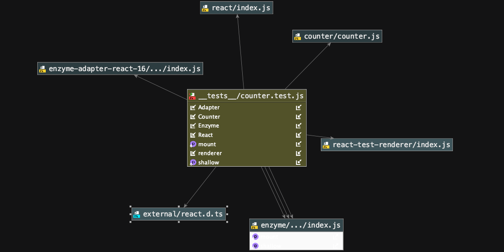

# react-testing-and-deployment

####unit and acceptance tests for the counter application

## Author: Alistair Blake

#### Links and Resources
Github:  https://github.com/Alwynblake/react-testing-and-deployment

AWS S3:  http://react-testing-and-deploy.s3-website-us-west-2.amazonaws.com/#

Amplify:  https://master.d3ad2b4ou8ie7y.amplifyapp.com/

Netlify: https://blissful-heyrovsky-58efa5.netlify.com/

### Feature Tasks:
* Wrote tests to cover the counter component
* Wrote tests For Up and Down events
* Asserted state changes properly
* Asserted that state is being transferred to the DOM

### UML:
